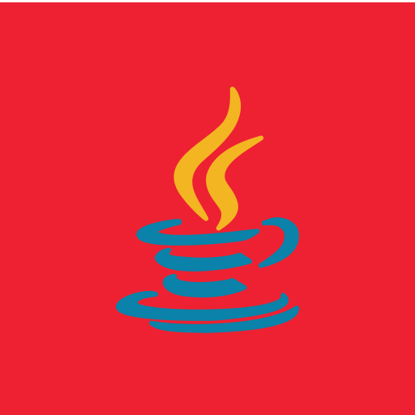

    

 
 
 

 
 
 

  

 

 

   
 

 
 
 

 
 

  
     
     
     
     
    

 
 

  
  

 
 

<picture align="center">
  <source media="(prefers-color-scheme: dark)" srcset="https://raw.githubusercontent.com/VicLiger/VicLiger/output/github-contribution-grid-snake-dark.svg">
  <source media="(prefers-color-scheme: light)" srcset="https://raw.githubusercontent.com/VicLiger/VicLiger/output/github-contribution-grid-snake-dark.svg">
  
</picture>
